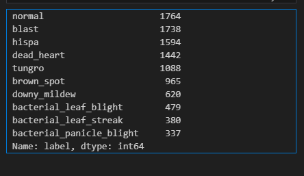

# collaborative filtering
## Understanding GPU memory usage

> df = pd.read_csv(path/'train.csv')
df.label.value_counts()

#選擇最小的，我們只需要337張圖像即可訓練模型，較長時間的訓練不會使用更多內存，因此使用最小的訓練集，我們就能知道這個模型使用多少記憶體
> trn_path = path/'train_images'/'bacterial_panicle_blight'

> def train(arch, size, item=Resize(480, method='squish'), accum=1, finetune=True, epochs=12):
    dls = ImageDataLoaders.from_folder(trn_path, valid_pct=0.2, item_tfms=item,
        batch_tfms=aug_transforms(size=size, min_scale=0.75), bs=64//accum)
    cbs = GradientAccumulation(64) if accum else []
    learn = vision_learner(dls, arch, metrics=error_rate, cbs=cbs).to_fp16()
    if finetune:
        learn.fine_tune(epochs, 0.01)
        return learn.tta(dl=dls.test_dl(tst_files))
    else:
        learn.unfreeze()
        learn.fit_one_cycle(epochs, 0.01)
